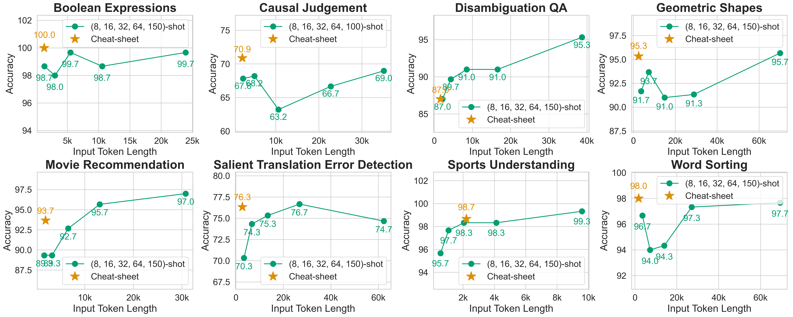

# Distilling Many-Shot In-Context Learning into a Cheat Sheet

This repository implements the main experiments of our paper, [Distilling Many-Shot In-Context Learning into a Cheat Sheet]() (EMNLP 2025 Findings).
We introduce **cheat-sheet ICL**, which distills the information from many-shot ICL into a concise textual summary (cheat sheet) used as the context at inference time.
This approach achieves comparable or better performance than many-shot ICL with far fewer tokens in challenging reasoning tasks, and matches retrieval-based ICL without requiring test-time retrieval.
The code is intended solely for reproducing the experiments.

<p align="center">
  
  &nbsp;&nbsp;&nbsp;
  
</p>


## Environment

We tested the code in the following environment.

* OS: Ubuntu 22.04.5 LTS
* Python: 3.12


## Setup

### Python and Packages

We used [uv](https://github.com/astral-sh/uv) to manage Python and its packages.
```bash
git clone https://github.com/CyberAgentAILab/cheat-sheet-icl.git
cd cheat-sheet-icl

# (Optional) If this version of Python is not installed
uv python pin 3.12
uv python install

# Create a virtual environment and install dependencies
uv venv --python 3.12 --python-preference managed
uv pip install --no-cache --force-reinstall -r requirements.txt
```

### API Keys

The code assumes that the API keys are stored in environment variables.
Fill in the `.envrc` file and load it.  
`GEMINI_API_KEY` is optional; it is only required when running the cheat-sheet transferability experiments.

```bash
cp .envrc_example .envrc

`Fill in the .envrc file with your API keys`

# If you are using direnv
direnv allow
# Otherwise
source .envrc
```

### Data

Run the following command to download the rationale-augmented BBH data.
The cheat sheets used in our experiments can also be found in [`data/cheat_prompt`](data/cheat_prompt).
The files in [`data/cheat_prompt`](data/cheat_prompt) and [`data/metaprompt`](data/metaprompt) are adapted from [BIG-Bench-Hard](https://github.com/suzgunmirac/BIG-Bench-Hard).

```bash
cd data
curl -L -O https://storage.googleapis.com/ailab-public/cheat-sheet-icl/data/aug_data_bbh.zip
unzip -q aug_data_bbh.zip
rm aug_data_bbh.zip
```

**(Optional)** If you want to run rationale augmentation and cheat-sheet creation from scratch, download [BBH data](https://github.com/suzgunmirac/BIG-Bench-Hard/archive/refs/heads/main.zip) and place them under `data`.
The other datasets can be downloaded automatically with the Hugging Face Datasets library, but you will need to request access to [GPQA](https://huggingface.co/datasets/Idavidrein/gpqa) using your Hugging Face account and then run `uv run huggingface-cli login`.
Then run [`script/preproc.sh`](script/preproc.sh) for BBH and [`script/preproc_acad.sh`](script/preproc_acad.sh) for the academic benchmarks.

```bash
cd data
curl -L -O https://github.com/suzgunmirac/BIG-Bench-Hard/archive/refs/heads/main.zip
unzip -q main.zip
rm main.zip
```


## Run

Below are sample commands for running the experiments. See [`script`](script) for more examples.  

> [!NOTE]
> * We used Azure OpenAI API for GPT-4.1.
> * We used the specific version `gpt-4.1-2025-04-14`, and the code assumes that the deployment name is the same.
>   - If you want to use a different deployment name, modify `model_libs` in [`src/args_utils.py`](src/args_utils.py).
> * The Azure OpenAI content filters were disabled upon our request.

```bash
META_MODEL="gpt-4.1-2025-04-14"
MODEL="gpt-4.1-2025-04-14"
TASK="bbh_salient_translation_error_detection"
REASON="gen"
SEED=1000

# Few-shot ICL (8-shot)
uv run src/run_main_api.py \
    --task ${TASK} \
    --meta_model ${META_MODEL} \
    --model ${MODEL} \
    --reason_type ${REASON} \
    --prompt_type shot \
    --shot 8 \
    --seed ${SEED}

# Many-shot ICL (n-shot)
uv run src/run_main_api.py \
    --task ${TASK} \
    --meta_model ${META_MODEL} \
    --model ${MODEL} \
    --reason_type ${REASON} \
    --prompt_type shot \
    --shot 0 \
    --seed ${SEED}

# Cheat-sheet ICL
uv run src/run_main_api.py \
    --task ${TASK} \
    --meta_model ${META_MODEL} \
    --model ${MODEL} \
    --reason_type ${REASON} \
    --prompt_type cheat \
    --shot 0 \
    --seed ${SEED}
```


## Citation

```bibtex
@inproceedings{honda-etal-2025-distilling,
    title = "Distilling Many-Shot In-Context Learning into a Cheat Sheet",
    author = "Honda, Ukyo and Murakami, Soichiro and Zhang, Peinan",
    booktitle = "Findings of the Association for Computational Linguistics: EMNLP 2025",
    year = "2025",
}
```
